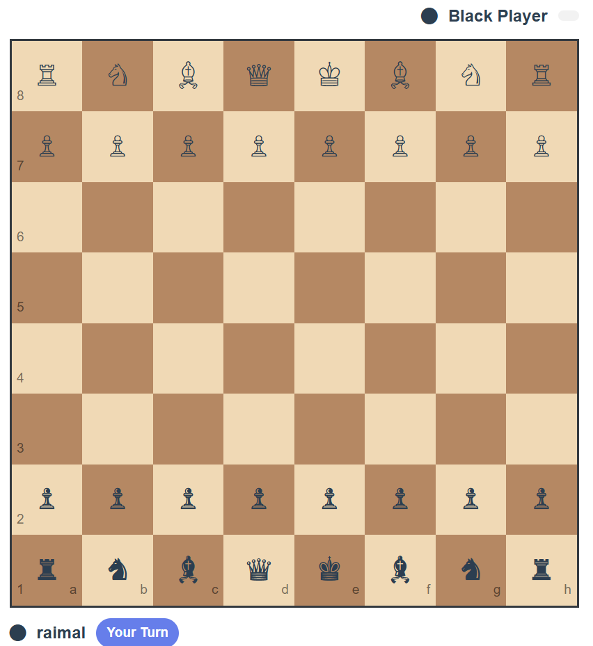

# End-to-End Chess bot FlaskApp

*A web-based chess application with bot opponent, built using Flask and Python.*

## 🧩 Overview

This project offers a complete web application where a user can log in/register, play a game of chess against a bot, and view the board and moves in real time.
The backend is written in Python using the Flask micro-framework. The chess logic (move validation, bot behaviour, game state) is handled in Python modules such as `chess_logic.py`, `analysis.py`, `ai.py`.
The front-end uses HTML, CSS, JavaScript (in the `templates` and `static` folders) to provide the game interface. User authentication, database models (via `models.py`), and migrations are included.

## 🎮 Screenshots

Below are some visual snapshots of the application:




## 🚀 Features

* User authentication (login/register)
* Chess board UI in browser, move input & display of game state
* Bot opponent with logic defined in `ai.py`
* Move analysis and game-state logic in `chess_logic.py`
* Persistent game states (via database models in `models.py`)
* Use of migrations (folder `migrations`) to handle database schema
* Modular structure: e.g., `analysis.py` handles game-analysis routines

## 🔧 Tools & Technologies

* **Flask** – lightweight web-framework for Python. ([flask.palletsprojects.com][1])
* **Python** – core logic language
* **SQLite / SQLAlchemy** – for persistence (via `models.py`)
* **HTML / CSS / JS** – front-end UI
* **Migrations** (Flask-Migrate or Alembic implied)
* Possibly front-end board library (if used) – e.g., `chessboard.js`, `chess.js` (check repo code)
* Modular Python design: separate modules for logic, AI, models, etc
* Version control: Git (via this GitHub repo)

## 📁 Project Structure

```
/__pycache__/  
/instance/  
/migrations/  
/static/  
/templates/  
ai.py  
analysis.py  
app.py  
chess_logic.py  
models.py  
requirements.txt  
.gitignore  
Snaps/
```

* `app.py`: Main Flask application entrypoint
* `chess_logic.py`: Game rules, state updates, move validation
* `ai.py`: Bot logic / strategy
* `analysis.py`: Possibly contains analysis routines or helper functions
* `models.py`: Database models (e.g., Users, Games, Moves)
* `requirements.txt`: Python dependencies
* `Snaps/`: Folder containing screenshots
* `static/` and `templates/`: Front-end assets (CSS, JS, HTML)
* `migrations/`: Database migration files
* `instance/`: Private instance configuration (possibly for Flask)

## 📝 Installation & Setup

1. Clone the repository

   ```bash
   git clone https://github.com/Raimal-Raja/End-to-End-Chess-bot-FlaskApp.git
   cd End-to-End-Chess-bot-FlaskApp
   ```
2. Set up a Python virtual environment

   ```bash
   python3 -m venv venv
   source venv/bin/activate  # or venv\Scripts\activate on Windows
   ```
3. Install dependencies

   ```bash
   pip install -r requirements.txt
   ```
4. Configure the database (check `instance/` for config)
5. Apply database migrations

   ```bash
   flask db upgrade
   ```
6. Run the application

   ```bash
   flask run
   ```
7. Open your browser at `http://localhost:5000` (or configured address) and register/login to start a game.

## 📚 Resources & Further Reading

### Chess Competitions & Community

* [FIDE (International Chess Federation)](https://www.fide.com) – official chess competitions and ratings
* [Chess.com Tournaments](https://www.chess.com/tournaments) – online tournaments and community
* [Lichess Events](https://lichess.org/tournament) – free and open-source chess platform

### Chess Rules & Game Logic

* [Official FIDE Laws of Chess](https://handbook.fide.com/chapter/E012021)
* [Chess Basics – Moves, Pieces & Board](https://www.chess.com/learn-how-to-play-chess)
* [Algebraic Notation of Chess Moves](https://en.wikipedia.org/wiki/Algebraic_notation_%28chess%29)

### Bot / Python Modules & Libraries

* [python-chess library documentation](https://python-chess.readthedocs.io/) – Useful for board representation, move generation
* [Flask Official Documentation](https://flask.palletsprojects.com/) – for building web apps in Python. ([flask.palletsprojects.com][1])
* [SQLAlchemy ORM](https://docs.sqlalchemy.org/) – for database modelling
* [chessboard.js](https://chessboardjs.com/) & [chess.js](https://github.com/jhlywa/chess.js) – JavaScript libraries for chess UI and logic

### License

Specify the license under which this project is released (e.g., MIT License). If none is present, consider adding one.
Example:

```
MIT License  
© 2025 Raimal Raja
```

## ✅ Contribution

Contributions, issues and feature requests are welcome! Feel free to fork the repo and submit pull requests. Please ensure your code adheres to the project style and includes appropriate tests / documentation.

## 📌 Future Enhancements

* Add multiple difficulty levels for the bot
* Enable online multiplayer mode (user vs user)
* Improve UI/UX board animations
* Add move-history display and analysis for finished games
* Deploy the app to a cloud service (Heroku, AWS, etc)

---
